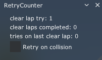

# Retry Counter

## Features
- A widget that shows amount of `Back to Pits` action called in single session
- Resets when clear lap happen
- Shows amout of tries on last lap (not implemented yet) 
- Automatically move you back to pits if you got off track (if `Retry on collision` is enabled)

## Installation

download release and place folder in `Steam\steamapps\common\assettocorsa\apps\lua`

## Usage

Use it when you learn new car and/or new track to compare how many tries you need to complete a lap without crashing into things and getting off track
